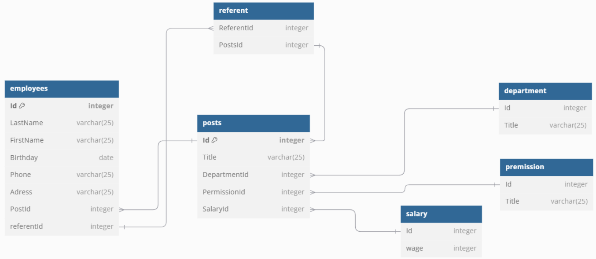
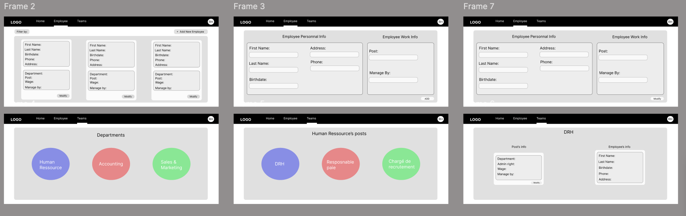

Projet Final : Edgar et Aurélien

Le Projet en quelque phrases :
Créer un système de gestion des employés d’une entreprise.

• Créer une base de données SQL qui permet de stocker les informations sur les
employés, les départements et les postes.

• Utiliser des requêtes SQL pour extraire les informations de la base de données et
les afficher sur une page web.

• Utiliser des concepts de HTML et CSS pour créer une interface utilisateur
conviviale pour afficher les informations de la base de données.

• Utiliser des formulaires HTML pour permettre aux utilisateurs de saisir des
informations et de les envoyer à la base de données via des requêtes SQL.

• Créer des pages de navigation pour permettre aux utilisateurs de parcourir les
différentes sections du site. 

Les langages utilisé son :
Golang, html, Css, SQL.

Pour lancer le projet :

- Si la base de données n'est pas présente exécuter cette commande sous un environnement WSL :
sqlite3 bdd.db < data.sql
- Pour remplir la base de données effectuer cette commande toujours sous un environnement WSL :
sqlite3 bdd.db < insert.sql
- Pour lancer le serveur effectuer la commande encore sous un environnement WSL :
go run .

Schéma diagramme bdd :

Premier maquette du site :
